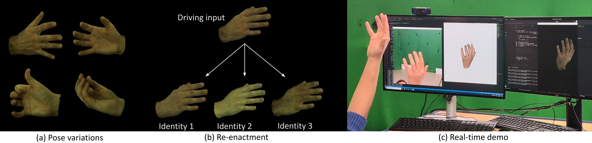

# LiveHand: Real-time and Photorealistic Neural Hand Rendering #
## Official PyTorch implementation of the ICCV '23 paper ##

[Project page](https://vcai.mpi-inf.mpg.de/projects/LiveHand/) | [Paper](https://vcai.mpi-inf.mpg.de/projects/LiveHand/data/LiveHand%20-%20Real-time%20and%20Photorealistic%20Neural%20Hand%20Rendering.pdf)





## Abstract ##
The human hand is the main medium through which we interact with our surroundings. Hence, its digitization is of uttermost importance, with direct applications in VR/AR, gaming, and media production amongst other areas. While there are several works modeling the geometry of hands, little attention has been paid to capturing photo-realistic appearance. Moreover, for applications in extended reality and gaming, real-time rendering is critical. We present the first neural- implicit approach to photo-realistically render hands in real-time. This is a challenging problem as hands are textured and undergo strong articulations with pose-dependent effects. However, we show that this aim is achievable through our carefully designed method. This includes training on a low- resolution rendering of a neural radiance field, together with a 3D-consistent super-resolution module and mesh-guided sampling and space canonicaliza- tion. We demonstrate a novel application of perceptual loss on the image space, which is critical for learning details accurately. We also show a live demo where we photo-realistically render the human hand in real-time for the first time, while also modeling pose- and view-dependent appearance effects. We ablate all our design choices and show that they optimize for rendering speed and quality. 


## Table of contents
-----
  * [Installation](#installation)
  * [Preparing the dataset](#dataset)
  * [Usage](#usage)
    + [Rendering pipeline](#rendering-pipeline)
    + [Training a new model](#training-a-new-model)
  * [Citation](#citation)
  * [License](#license)
------


## Installation ##

Clone the repository and install the dependencies:
```bash
git clone https://github.com/amundra15/livehand.git
cd livehand
conda create --name livehand python=3.10
conda activate livehand
pip install -r requirements.txt
pip install --editable .
```

<!-- subsection for optional installations -->
### Optional installations  ###
The codebase supports heirarchical sampling (by setting N_importance > 0 in the config file). Install [torchsearchsorted](https://github.com/aliutkus/torchsearchsorted/tree/master) to support this. You DO NOT need this installation to run the default livehand method.


## Preparing the dataset ##
Download the [InterHand2.6M dataset](https://mks0601.github.io/InterHand2.6M/) and run the following commands to prepare the dataset:

### Option 1: Running sequentially on a single machine ###
```bash
cd preprocessing/InterHands2.6M
python prepare_dataset.py --input_dir path/to/dataset --output_dir path/to/output/dir
```

### Option 2: Running in parallel on a slurm cluster ###
```bash
cd preprocessing/InterHands2.6M
# Set the input and output directories in run_prepare_dataset_cluster.sh
sbatch run_prepare_dataset_cluster.sh
```

Note: Currently, the script has been configured to process the test/Capture0 sequence of the InterHands2.6M dataset. You can modify the script to process other sequences as well (change the variables 'mode' and 'allowed_capture_ids').


Next, run the following command to generate the poses_bounds.npy files:
```bash
# Set the metashape license path and the preprocessing output_dir from above in run_metashape.sh
./run_metashape.sh 
```


## Usage ##


### Rendering pipeline ###
You can download the pretrained model for test/Capture0 sequence from [here](https://nextcloud.mpi-klsb.mpg.de/index.php/s/Ba4c9DLDj8zDwSm).
Set the 'exp_folder' variable in scripts/render_experiments.sh to the path/containing/trained/model/checkpoint (NOTE: it supports pattern matching to specify multiple experiments).
Then run the following command to render the experiments:
```bash
./scripts/render_experiments.sh
```


### Training a new model ###
Set the following variables in the config file (configs/test_capture0): \
'expname': name of the experiment \
'data_fol': path/to/training/data \
'val_data_fol': path/to/validation/data \
'basedir': path/to/save/checkpoints

Then run the following command to train a new model:
```bash
./scripts/test_capture0.sh
```


## Citation ##
If you find this code useful for your research, please cite our paper:
```
@misc{mundra2023livehand,
	title={LiveHand: Real-time and Photorealistic Neural Hand Rendering}, 
	author={Akshay Mundra and Mallikarjun {B R} and Jiayi Wang and Marc Habermann and Christian Theobalt and Mohamed Elgharib},
  booktitle = {Proceedings of the IEEE/CVF International Conference on Computer Vision (ICCV)},
  month     = {October},
  year      = {2023},
}
```

This codebase adapts modules from [NeRF-PyTorch](https://github.com/yenchenlin/nerf-pytorch), [NeuralActor](https://vcai.mpi-inf.mpg.de/projects/NeuralActor/) and [EG3D](https://nvlabs.github.io/eg3d/). Please consider citing them as well.
```
@misc{lin2020nerfpytorch,
  title={NeRF-pytorch},
  author={Yen-Chen, Lin},
  publisher = {GitHub},
  journal = {GitHub repository},
  howpublished={\url{https://github.com/yenchenlin/nerf-pytorch/}},
  year={2020}
}

@article{liu2021neural,
      title={Neural Actor: Neural Free-view Synthesis of Human Actors with Pose Control}, 
      author={Lingjie Liu and Marc Habermann and Viktor Rudnev and Kripasindhu Sarkar and Jiatao Gu and Christian Theobalt},
      year={2021},
      journal = {ACM Trans. Graph.(ACM SIGGRAPH Asia)}
}

@inproceedings{Chan2021,
            author = {Eric R. Chan and Connor Z. Lin and Matthew A. Chan and Koki Nagano and Boxiao Pan and Shalini De Mello and Orazio Gallo and Leonidas Guibas and Jonathan Tremblay and Sameh Khamis and Tero Karras and Gordon Wetzstein},
            title = {Efficient Geometry-aware {3D} Generative Adversarial Networks},
            booktitle = {arXiv},
            year = {2021}
          }
```


## License ##
LiveHand is under [CC-BY-NC 4.0](https://creativecommons.org/licenses/by-nc/4.0/) license. The license also applies to the pre-trained models.
